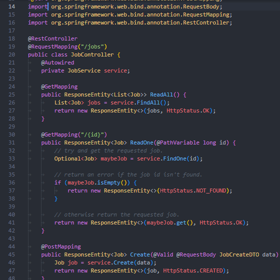

# Temp Resourcing API



## Setup

This project is written for Java 18.

To setup, [update the properties file to suit your SQL server.](src\main\resources\application.properties)

## MVP

Your task is to build a Resourcing API using the Java Spring Boot framework, that allows consumers to assign temps to jobs.

### Required Endpoints:

```
GET /jobs - Fetch all jobs
	...?assigned={true|false} - Filter by whether a job is assigned to a temp or not
	.../{id} - (id, name, tempId, startDate, endDate)

GET /temps - List all temps
	...?jobId={jobId} - List temps that are available for a job based on the jobs date range
	.../{id} - get temp by id (should also display jobs they’ve been assigned to)

POST /jobs - Creates a job
POST /temps - Create a temp

PATCH /jobs/{id} - Updates job, endpoint should be used to assign temps to jobs
```

### Assumptions

-   Temps can only have one job at a time (can’t be doing 2 jobs on the same date)
-   Temps can have many jobs, and job can have 1 temp assigned
-   Should be able to assign existing temps to jobs via POST /jobs & PATCH /jobs/{id}
-   You must use a relational database

### Bonus

-   Temps should be able to manage other temps (will require an additional field)
-   When you request a temp record it should display the reports of that temp
-   Should be represented in the database as a nested set (research what nested sets are)
-   GET /temps/tree - should display the whole tree of temps

## Implementation

The implementation for this project has two main controllers, one for Jobs and the other for Temps.

Temps can have multiple jobs, so long as they don't overlap. Jobs can only have one Temp.

All temps/jobs can be requested with a GET method, and can be added to with a POST.

There are specific routes to manage assigning jobs (POST /jobs/{jobId}/{tempId}), checking which jobs are assigned or not (GET /jobs?assigned={true|false}), and for finding temps that are available for a job (GET /temps?jobId={jobId}).

## Known Issues

_N/A_

## Retrospective

...

## Future Plans

-   Implement bonus features.
-   Modify date range and use JPQL Query.
-   Add more validation to job and temp create DTO.
-   Remove logic from controller to service.

## Related Projects

-   [Java Wordle](https://github.com/connorturlan/wordle-java) - A simplified version of Wordle written in Java for the command line.

## License

No license provided.

## Contributions

Made by Connor Turlan 2022.
